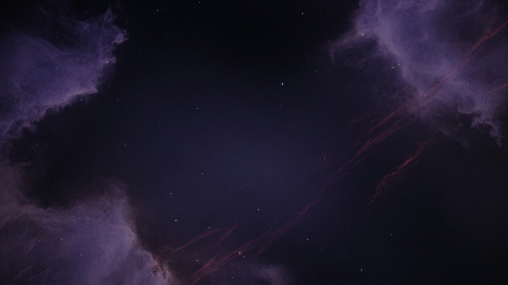
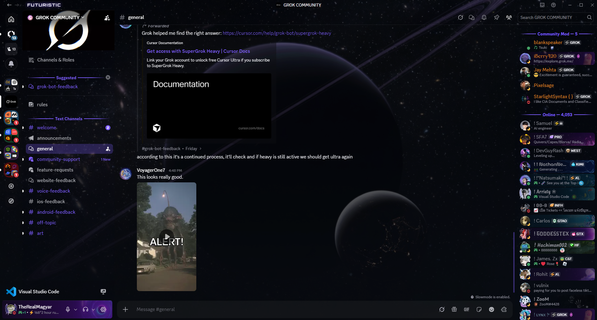
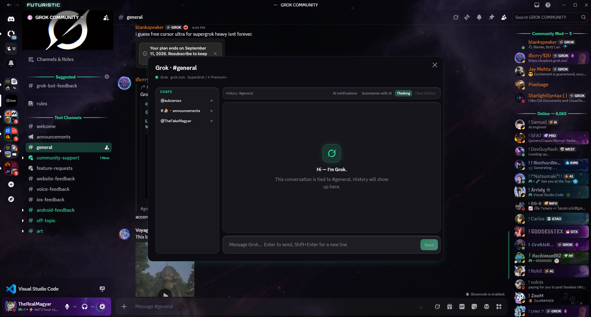
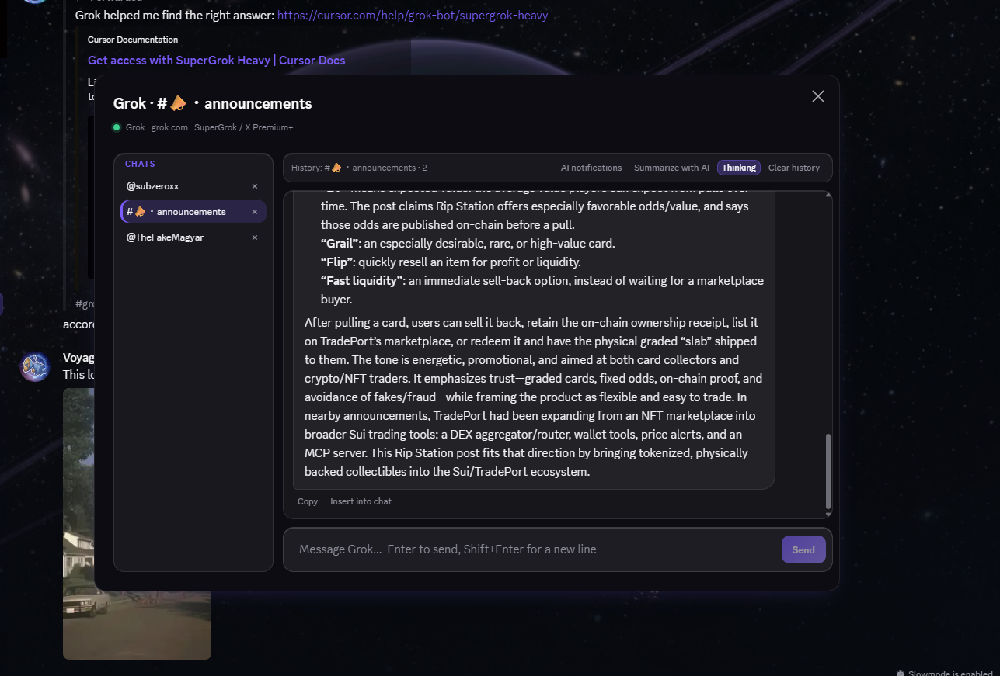
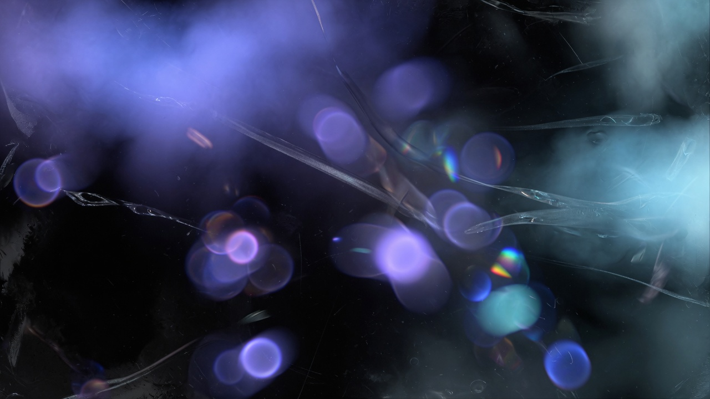
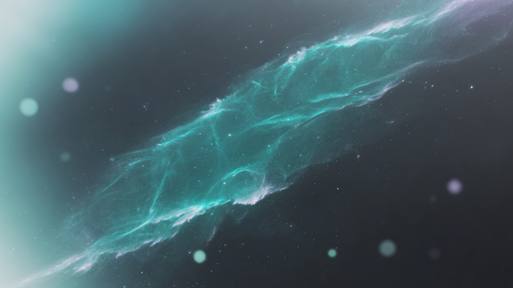
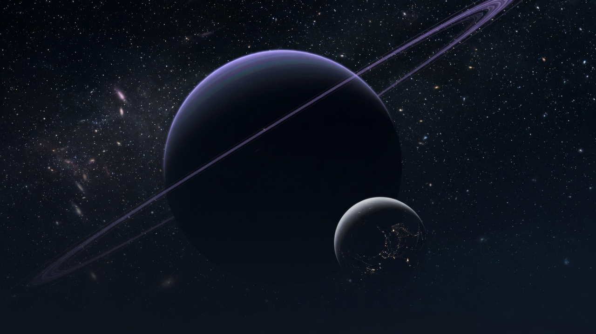
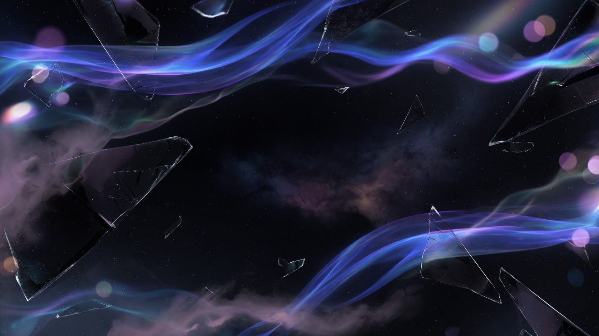

<p align="center">
  
</p>

<h1 align="center">Futuristic</h1>

<p align="center">
  Liquid-glass Discord theme for Vencord, Equicord, Vesktop, and BetterDiscord.<br>
  Deep void, accent chrome, and a full restyle of the
  <a href="https://github.com/TheRealMagyar/Vencord-ai-plugin">Vencord AI plugin</a>.
</p>

<p align="center">
  
  
  
</p>

<p align="center">
  <a href="#screenshots">Screenshots</a> ·
  <a href="#install">Install</a> ·
  <a href="#quick-start">Quick start</a> ·
  <a href="#wallpapers">Wallpapers</a> ·
  <a href="#colors">Colors</a> ·
  <a href="#icons">Icons</a> ·
  <a href="#settings-file">Settings</a> ·
  <a href="#troubleshooting">Troubleshooting</a>
</p>

---

## What you get

- Dark liquid-glass surfaces on Discord Dark / Darker / Midnight
- Settings live in **one file**: [`Futuristic.theme.css`](Futuristic.theme.css)
- Five space wallpapers in [`assets/`](assets/)
- Optional [Phosphor](https://phosphoricons.com/) duotone icon pack in [`assets/icons/`](assets/icons/)
- Restyle of the AI plugin windows (`vc-grokai-*`)
- Live blur **off** by default so chat stays smooth

The theme file is knobs only (colors, wallpaper, fonts, icons). Glass, motion, and AI chrome load from [`engine/`](engine/).

Enable **only this theme**. Another full theme on top will clash.

---

## Screenshots

<p align="center">
  
</p>
<p align="center"><sub>Chat</sub></p>

<p align="center">
  
</p>
<p align="center"><sub>AI plugin</sub></p>

<p align="center">
  
</p>
<p align="center"><sub>AI conversation</sub></p>

---

## Install

### 1. Copy the settings file

Put [`Futuristic.theme.css`](Futuristic.theme.css) in the themes folder. Do not copy the whole repo unless you want it.

| Client | Folder |
| --- | --- |
| Vencord (Windows) | `%appdata%\Vencord\themes` |
| Equicord (Windows) | `%appdata%\Equicord\themes` |
| Vesktop (Windows) | `%appdata%\vesktop\themes` |
| Vencord / Equicord (macOS) | `~/Library/Application Support/Vencord/themes` |
| Vesktop (macOS) | `~/Library/Application Support/vesktop/themes` |
| BetterDiscord (Windows) | `%appdata%\BetterDiscord\themes` |
| BetterDiscord (macOS) | `~/Library/Application Support/BetterDiscord/themes` |

### 2. Turn it on

Discord → **Settings → Themes → Local Themes** → enable **Futuristic**.

Turn off every other full theme.

### 3. Reload after edits

Save the file, then disable and enable the theme (or restart the client). CSS `@import` is cached; a toggle is enough most of the time.

### Online import

```css
@import url("https://github.com/TheRealMagyar/Futuristic/raw/main/Futuristic.theme.css");
```

The first load needs internet. Engine CSS comes from this GitHub repo. Wallpaper and icon `url()`s go through [jsDelivr](https://www.jsdelivr.com/) because Discord blocks `raw.githubusercontent.com` inside CSS `url()`. The files are still the ones in this repository.

---

## Quick start

Open `Futuristic.theme.css` and uncomment **at most one** block in each section:

1. **Colors** — Cyan / Emerald / Rose / Amber / Pure black  
2. **Wallpapers** — Void / Nebula / Ice / Orbit / Aurora  
3. **Icons** — the Phosphor pack (optional; default is Discord’s own marks)

Example: Nebula wallpaper + default violet accent.

```css
:root {
  --background-image: url("https://cdn.jsdelivr.net/gh/TheRealMagyar/Futuristic@main/assets/nebula.jpg");
  --background-shading-percent: 40%;
}
```

Leave extra CSS at the bottom of the file if you want local overrides.

---

## Wallpapers

Default is an accent-tinted void **gradient** (no photo fetch).

Uncomment **one** wallpaper block at the bottom of `Futuristic.theme.css`.

<p align="center">
  
  
</p>
<p align="center"><sub>Void · Nebula</sub></p>

<p align="center">
  
  
  
</p>
<p align="center"><sub>Ice · Orbit · Aurora</sub></p>

| Name | File | Look | Suggested shading |
| --- | --- | --- | --- |
| Void | [`assets/futuristic-void.jpg`](assets/futuristic-void.jpg) | Abstract purple bokeh | `40%` |
| Nebula | [`assets/nebula.jpg`](assets/nebula.jpg) | Violet dust, dark center | `40%` |
| Ice | [`assets/ice.jpg`](assets/ice.jpg) | Cyan / teal nebula | `42%` |
| Orbit | [`assets/orbit.jpg`](assets/orbit.jpg) | Ringed planet and moon | `38%` |
| Aurora | [`assets/aurora.jpg`](assets/aurora.jpg) | Glass shards and ribbons | `40%` |

Your own photo (HTTPS only):

```css
--background-image: url("https://example.com/your-image.jpg");
--background-shading-percent: 40%;
```

`--background-shading-percent` (default `64%`): lower shows more of the photo. Wallpaper blocks already drop this to about `40%`.

If the photo is missing, you will only see the dark void fill. Toggle the theme once after a new push — jsDelivr can lag a minute or two on brand-new files.

---

## Colors

Uncomment **one** accent block, or edit `--main-color` and `--hover-color` in `:root`.

| Variant | Accent | Hover |
| --- | --- | --- |
| Violet (default) | `#7c5cff` | `#9b82ff` |
| Cyan | `#22d3ee` | `#67e8f9` |
| Emerald | `#34d399` | `#6ee7b7` |
| Rose | `#fb7185` | `#fda4af` |
| Amber | `#f59e0b` | `#fbbf24` |
| Pure black | `#e5e7eb` | `#ffffff` |

Status colors live in the same `:root`: `--online-color`, `--idle-color`, `--dnd-color`, `--streaming-color`, `--offline-color`.

Use Discord **Dark**, **Darker**, or **Midnight**. Light is supported but not the intended look.

---

## Icons

Discord’s icons stay on until you uncomment the **Icons** block. Nothing is fetched until then.

The pack is [Phosphor](https://phosphoricons.com/) **duotone** (MIT), white on transparent so it masks to the current UI color. The Vencord AI plugin mark is **not** replaced.

| File | Replaces |
| --- | --- |
| `home.svg` | Direct Messages / home |
| `discover.svg` | Discover |
| `add.svg` | Add a server |
| `settings.svg` | User / server / channel settings |
| `inbox.svg` | Inbox |
| `help.svg` | Help |
| `nitro.svg` | Nitro |
| `shop.svg` | Shop |
| `gift.svg` | Gift |
| `emoji.svg` | Emoji picker |
| `gif.svg` | GIF picker |
| `sticker.svg` | Sticker picker |
| `search.svg` | Search |
| `pins.svg` | Pinned messages |
| `threads.svg` | Threads |
| `members.svg` | Member list |
| `call.svg` | Voice call |
| `video.svg` | Video call |
| `mute.svg` | Mute mic |
| `deaf.svg` | Deafen |
| `send.svg` | Send message |
| `notifications.svg` | Notification settings / mute channel |
| `notifications-off.svg` | Unmute channel |
| `attach.svg` | Upload / attach file |
| `apps.svg` | Apps launcher |
| `disconnect.svg` | Leave voice |
| `screenshare.svg` | Share screen |
| `soundboard.svg` | Soundboard |
| `activity.svg` | Activities |
| `invite.svg` | Invite people / add friend |
| `events.svg` | Events |
| `reply.svg` | Reply |
| `forward.svg` | Forward |
| `more.svg` | More / overflow |
| `edit.svg` | Edit |
| `bookmark.svg` | Bookmark / save |
| `friends.svg` | Friends / new group DM |
| `download.svg` | Download apps |
| `mention.svg` | Mention |
| `copy.svg` | Copy text / message |
| `delete.svg` | Delete |
| `create.svg` | Create channel / category |
| `info.svg` | Channel info |
| `link.svg` | Copy link |
| `boost.svg` | Server boost |
| `react.svg` | Add reaction |

One icon only (example: home):

```css
:root {
  --home-native: none;
  --home-icon: url("https://cdn.jsdelivr.net/gh/TheRealMagyar/Futuristic@main/assets/icons/home.svg");
}
```

Do **not** set `--icon-native: none` unless you enable the full pack. That flag hides native paths on every swapped control.

---

## Settings file

Everything a user is meant to change is in [`Futuristic.theme.css`](Futuristic.theme.css).

| Token | Default | What it does |
| --- | --- | --- |
| `--main-color` / `--hover-color` | `#7c5cff` / `#9b82ff` | Accent |
| `--success-color` / `--danger-color` | `#3ecf8e` / `#ff5c7a` | Positive / danger |
| `--background-image` | Void gradient | Gradient or `url(...)` |
| `--background-shading-percent` | `64%` | How much glass sits on the wallpaper |
| `--background-position` / `--background-size` | `center` / `cover` | Photo layout |
| `--background-attachment` | `scroll` | Keep `scroll` — `fixed` repaints the window |
| `--background-filter` | `none` | Extra saturate/brightness (costs FPS) |
| `--user-popout-filter` / `--user-modal-filter` | `none` | Profile frost |
| `--home-icon` | `none` | Custom DMs mark |
| `--main-font` / `--code-font` | gg sans / JetBrains Mono | Must be installed, except Orbitron |
| `--futuristic-overlay-filter` | `none` | Menu frost |

Engine internals (`engine/futuristic.css`) hold glass tokens, Discord token overrides, AI chrome, and motion. You do not need to edit those for normal use.

---

## AI plugin only

Keep another Discord theme and only restyle the AI windows: paste [`overrides/Futuristic-AI.override.css`](overrides/Futuristic-AI.override.css) into Vencord → Settings → **QuickCSS**.

---

## Performance

Live `backdrop-filter` is off on chat, menus, and profiles. The wallpaper paints on `#app-mount` (and Discord’s bg layer when it exists). No `background-attachment: fixed` and no photo `filter` in the stock wallpaper blocks.

To turn frost back on:

```css
--futuristic-overlay-filter: blur(14px) saturate(1.18);
--user-popout-filter: blur(16px) saturate(1.2) brightness(0.82);
--user-modal-filter: blur(18px) saturate(1.15) brightness(0.8);
```

If Discord still stutters, keep those at `none` and stay on the default gradient (no photo).

---

## Troubleshooting

| Symptom | What to do |
| --- | --- |
| Wallpaper does not show | Uncomment **one** wallpaper block. Toggle the theme. Wait a minute if the file was just pushed (jsDelivr cache). Confirm the URL is `cdn.jsdelivr.net/gh/TheRealMagyar/Futuristic@main/...`. |
| Wallpaper URL from `raw.githubusercontent.com` | Discord’s CSS `url()` often blocks that host. Use the jsDelivr URL from the settings file. |
| Icons look like Discord’s | The pack is commented out on purpose. Uncomment the **Icons** block. |
| Icons vanished | You set `--icon-native: none` without loading the full pack. Remove that line or enable the whole Icons block. |
| Theme looks like ClearVision / another skin | Another full theme is still enabled. Disable it. |
| First load is unstyled | No internet — engine `@import`s fail. |
| Stutter on scroll | You still have `background-attachment: fixed` or a `filter` on the photo. Remove them. |
| Titlebar says Futuristic | Expected on Windows. macOS uses the native titlebar. |

---

## Repo layout

```
Futuristic.theme.css     settings you edit
engine/main.css          ClearVision engine
engine/vencord.css       Vencord / Equicord bits
engine/betterdiscord.css BetterDiscord bits
engine/futuristic.css    Futuristic glass, AI, motion, icon hooks
assets/                  wallpapers
assets/icons/            Phosphor duotone SVGs
assets/screenshots/      README shots (01-chat, 02-server, 03-ai)
overrides/               AI-only QuickCSS
```

---

## License

MIT. See [LICENSE](LICENSE).

Third-party bits are listed in [NOTICE](NOTICE): ClearVision engine (Apache 2.0) and [Phosphor Icons](https://github.com/phosphor-icons/core) (MIT).
